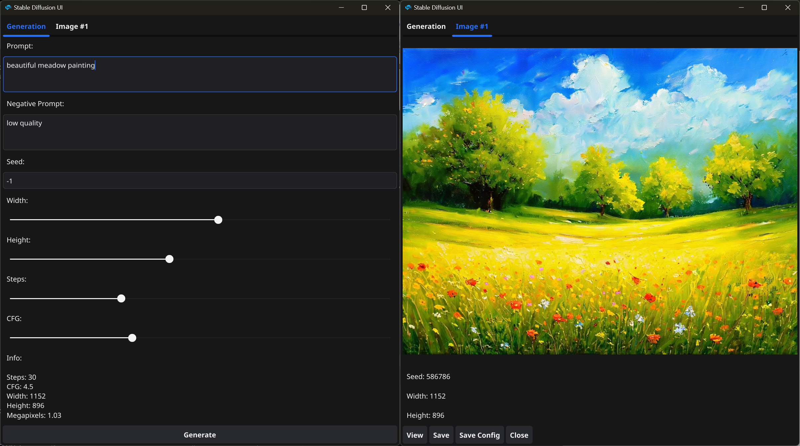

# SDGO - Stable Diffusion 3.5 with Go
**SDGO** is a small project that aims to simplify working with the original SD 3.5 [repository](https://github.com/Stability-AI/sd3.5) and provides a Go-based front-end.

Features:
- Image generation as in the original repository
- Negative prompt support
- Minimal non-browser interface with tabs
- Size sliders have a step of 64, plus there is a megapixel counter in the UI
- Dynamic previews with a step of 5

To do:
- Add config saving button functionality

## Using SDGO
### Prequisites
To run SDGO your machine must meet the following requirements:
>Hardware: 32Gb of RAM, CUDA GPU with 12 Gb of VRAM, 20Gb of free space
>OS: Windows 10 or 11, x64
### Release package
The recommended way of running the program is by downloading the latest release from the **Releases** section of this repository. There, you will find `sdgo-portable-release.7z`, which you should unzip and populate the `models` folder with files from huggingface: [SD 3.5 Medium](https://huggingface.co/stabilityai/stable-diffusion-3.5-medium/blob/main/sd3.5_medium.safetensors), [Clip-L](https://huggingface.co/stabilityai/stable-diffusion-3.5-large/blob/main/text_encoders/clip_l.safetensors), [BigG](https://huggingface.co/stabilityai/stable-diffusion-3.5-large/blob/main/text_encoders/clip_g.safetensors), [T5-XXL](https://huggingface.co/stabilityai/stable-diffusion-3.5-large/blob/main/text_encoders/t5xxl_fp16.safetensors) and [VAE](https://huggingface.co/stabilityai/stable-diffusion-3.5-medium/blob/main/vae/diffusion_pytorch_model.safetensors).
Then, launch `sdgo.exe` and wait until the console window says that the models are loaded. The image outputs will be located in the `outputs` folder, but one can copy and rename the original file from within the UI via the Save button.

## License
As of now, the original files of the project do not have a defined license, but the backend files have the original MIT License stated in SD 3.5 repository.
However, if you wish to copy and/or modify the files for distribution, you are free to do so, but must provide a link to the SDGO repository.